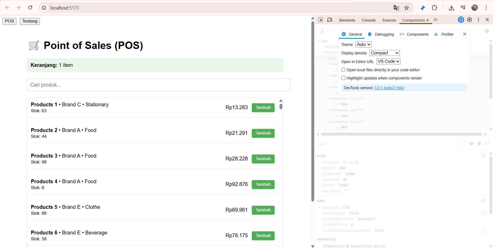
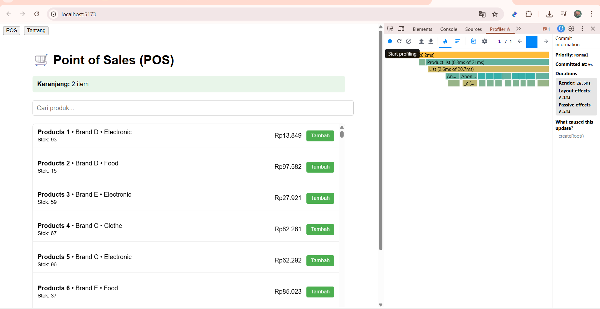
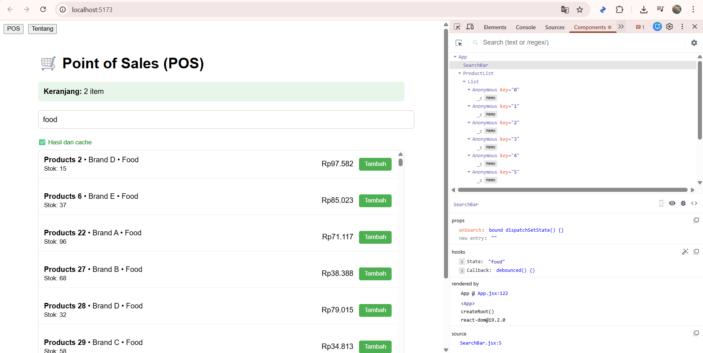

# 🧾 Tugas React Optimization — POS (Point of Sales) with React Query

## 📘 Deskripsi
Proyek ini merupakan pengembangan dari aplikasi **POS (Point of Sales) – Optimized React App** yang telah diimplementasikan dengan berbagai teknik optimasi performa seperti:
- `React.memo`, `useMemo`, dan `useCallback` (memoization)
- `Debouncing` untuk pencarian efisien
- `Virtualization` menggunakan `react-window`
- `Code Splitting` dengan `React.lazy`
- `localStorage` untuk persistensi keranjang
- `Caching` berbasis `Map` dan `localStorage`

Pada branch **`react-query`**, aplikasi ini dikembangkan lebih lanjut dengan **React Query** untuk pengelolaan data dan caching otomatis, menggantikan sistem cache manual sebelumnya.

---

## ⚙️ Langkah Instalasi dan Menjalankan Aplikasi

### 1️⃣ Clone repository
```bash
git clone https://github.com/username/pos-optimized.git
cd pos-optimized
2️⃣ Ganti ke branch react-query
bash
Copy code
git checkout react-query
3️⃣ Install dependencies
bash
Copy code
npm install
4️⃣ Jalankan aplikasi
bash
Copy code
npm run dev
📊 Eksperimen: Perbandingan Sebelum dan Sesudah React Query
Aspek	Sebelum React Query (Custom Cache)	Sesudah React Query
Caching	Manual (Map + localStorage)	Otomatis & persistent
Fetching Data	Filter array secara lokal	Simulasi fetch + cache otomatis
Update Data	Harus manual setState	useMutation & auto refetch
Performance (Profiler)	Render ulang lebih sering	Render lebih sedikit (karena cache stabil)
Pengelolaan Cache	Harus diatur sendiri	Dikelola oleh React Query
UX Responsiveness	Kadang lag jika data besar	Lebih responsif, instant load dari cache

🔍 Cara Menguji Performanya
Gunakan React DevTools → Profiler

Jalankan aplikasi sebelum dan sesudah memakai React Query.

Lihat durasi render pada komponen ProductList dan ProductRow.

Amati pengurangan re-render setelah cache aktif.

Gunakan Network Tab (DevTools Browser)

Perhatikan request data hanya dilakukan sekali.

Saat data diambil ulang, React Query menampilkan data dari cache tanpa delay.

Cek Status Cache

Buka tab React Query DevTools (jika terpasang).

Lihat cache key dan waktu validasi otomatis.

📦 React Query — Penjelasan Cache Otomatis
React Query mengelola cache secara otomatis dengan konsep:

Query Key: setiap request unik disimpan berdasarkan nama key.

Stale Time: waktu data dianggap valid sebelum refetch otomatis.

Background Fetching: React Query otomatis memperbarui data tanpa mengganggu tampilan pengguna.

Garbage Collection: cache lama akan dibersihkan otomatis setelah tidak digunakan.

Dengan ini, data tetap fresh, realtime, dan tidak boros request ke server.

💡 Keuntungan Menggunakan Library dibanding Custom Cache
Aspek	Custom Cache	React Query
Implementasi	Manual (Map, localStorage)	Otomatis
Maintenance	Rumit (hapus, update, TTL manual)	Dikelola otomatis
Integrasi API	Harus manual	Built-in useQuery, useMutation
DevTools	Tidak ada	Ada visualisasi query cache
Efisiensi	Tergantung implementasi	Sudah dioptimalkan

Kesimpulan: React Query lebih efisien, mudah dikelola, dan powerful dibanding cache manual.

🧠 Kesimpulan
Menggunakan cache (baik localStorage maupun React Query) meningkatkan performa aplikasi karena:

Data sering diakses langsung dari cache (tanpa re-fetch).

Komponen tidak perlu re-render terus.

Aplikasi terasa lebih cepat dan responsif.

Namun, React Query lebih unggul karena cache-nya dikelola otomatis dan memiliki strategi validasi data yang lebih pintar dibandingkan custom cache sederhana.

📷 Laporan React Query (laporan-react-query.md)
Isi file laporan harus mencakup:

## 🧠 Screenshot DevTools – Cache Hit




Penjelasan singkat cache hit dari React Query DevTools

Jawaban pertanyaan:

“Apakah menggunakan cache atau localStorage menyebabkan aplikasi menjadi lebih baik? Kenapa?”

Jawaban singkat:

Ya, karena cache membuat data diambil dari memori, bukan diolah ulang atau diminta ulang dari server, sehingga respons UI jauh lebih cepat dan efisien.

✍️ Dibuat oleh:
Nama: Daffa' Zaki Al Farras
Mata Kuliah: Pemrograman Frontend — Optimasi Performa React
Dosen: Nanang M. Yusuf, S.Kom., M.Kom